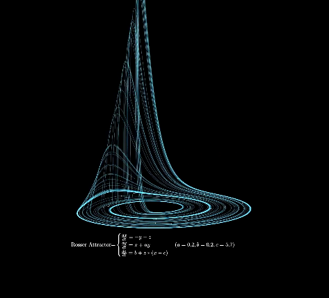

## Rossler Attractor

罗斯勒吸引子（/ ˈ r ɒ s l ər /）是罗斯勒系统的吸引子，该系统由三个非线性常微分方程组成，最初由奥托·罗斯勒在 20 世纪 70 年代研究。[1] [2]这些微分方程定义了一个连续时间动力系统，该系统表现出与吸引子的分形特性相关的混沌动力学。 [3]罗斯勒将其解释为一种拉糖机的形式化。[4]

罗斯勒系统的一些性质可以通过线性方法推导，例如特征向量，但系统的主要特征需要非线性方法，例如庞加莱映射和分岔图。罗斯勒的原始论文指出，罗斯勒吸引子的行为类似于洛伦兹吸引子，但也更容易定性分析。[1]吸引子内的轨道遵循接近
𝑋
，
是
{\displaystyle x,y}平面围绕一个不稳定的固定点。一旦图形螺旋向外足够大，第二个固定点就会影响图形，导致图形上升和扭曲
是
{\displaystyle z}维。在时间域中，很明显，虽然每个变量都在固定的数值范围内振荡，但振荡是混乱的。该吸引子与洛伦兹吸引子有一些相似之处，但更简单，只有一个流形。奥托·罗斯勒于 1976 年设计了罗斯勒吸引子，[1]但后来发现最初的理论方程可用于模拟化学反应中的平衡。

### 视频截图

### 视频文案
奇异吸引子(Strange Attractor)
Strange Attractor 是在混沌理论中描述的一类吸引子，它的轨迹在相空间中呈现出复杂、非重复的图案。Strange Attractor 于20世纪60年代由气象学家 Edward Lorenz 发现，当时他在研究简单的大气模型时，意外观察到了这种现象。Lorenz 吸引子是最著名的例子之一。

Strange Attractor 的应用范围广泛，包括气象学、物理学、生物学和工程学中的动态系统分析。它们帮助科学家理解和预测复杂系统的行为，即便这些系统看似随机。

编程可视化 Strange Attractor 是一个非常有趣的项目。使用 Python 等编程语言，可以通过库如 Matplotlib 和 NumPy 绘制吸引子的轨迹。例如，通过编写代码模拟 Lorenz 吸引子，可以生成其三维图像，直观展示其混沌特性。这样的可视化不仅有助于理解理论，还能激发学生对混沌学和计算科学的兴趣。

今天我们绘制的是Rosser Attractor(罗斯勒吸引子)

【数学】
1. Rosser Attractor吸引子方程（详见视频）
【编程】
1. Python基础应用
2. Numpy库的使用
3. 视频渲染和绘图